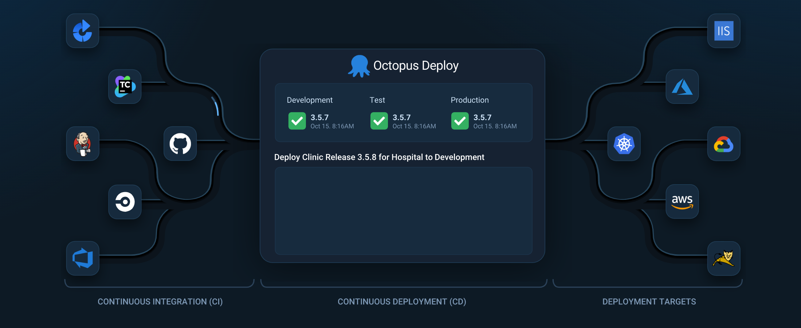
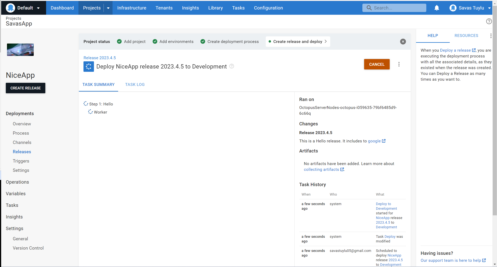
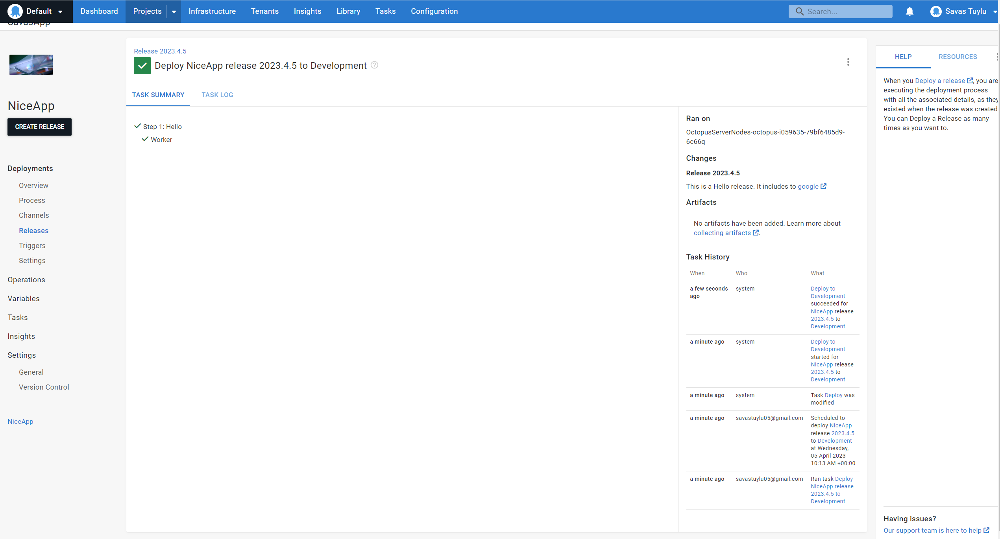
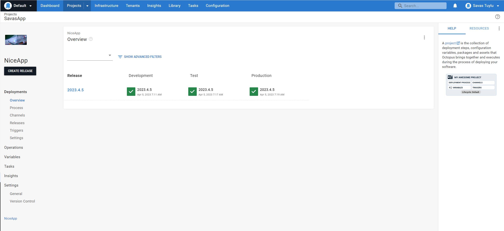
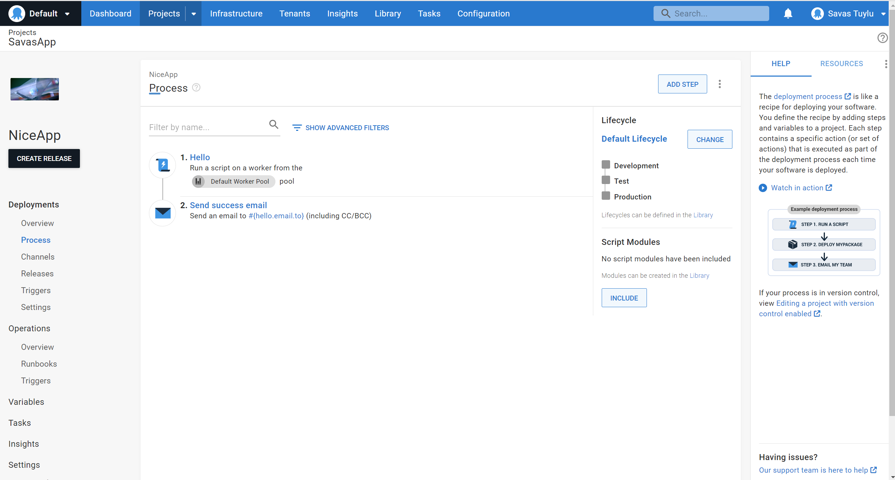
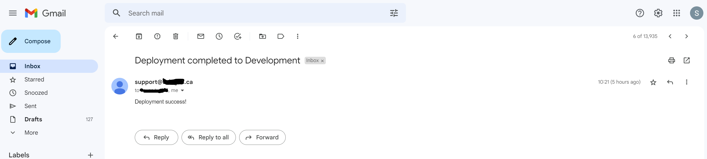

# Octopus Deploy

Octopus Deploy is a powerful and flexible deployment automation tool that helps teams automate their release processes. This document provides guidance on how to release and deploy your application using Octopus Deploy.

## Prerequisites
Before you start, you will need the following:

An Octopus Deploy account and access to the Octopus Deploy UI.
+ A deployed Octopus Server.
+ A package or set of packages to deploy.
+ A target environment to deploy to, such as a staging or production environment.
+ A configured deployment process, including any necessary steps, variables, and configuration.

## Release and Deployment Process
The following is a general process for releasing and deploying your application using Octopus Deploy:

1. Create a release in Octopus Deploy for your application by specifying the package version, target environment, and any required variables or configuration.
2. Initiate the deployment process, which will deploy the package to the specified environment(s) according to the configured steps.
3. Monitor the deployment progress through the Octopus Deploy UI, and troubleshoot any issues that arise.
4. Once the deployment is complete, verify that the application is functioning as expected in the target environment(s).

## Deployment

 During Deployment

## Deployment in Multi-Environment

## Release and Deployment Best Practices
To ensure a smooth and successful release and deployment process, consider the following best practices:

+ Use version control for your application code, and ensure that your deployment process is also version controlled.
+ Use a release management tool to manage your release and deployment processes, such as Octopus Deploy.
+ Test your deployment process in a staging or testing environment before deploying to production.
+ Monitor the deployment progress and verify the success of each step in the process.
+ Ensure that all necessary prerequisites are met before initiating a deployment.
+ Automate as much of the deployment process as possible to minimize the risk of human error.

## Email Notification

## Log

In Detail

## Conclusion
Octopus Deploy provides a powerful and flexible solution for automating your release and deployment processes. By following best practices and leveraging the features of Octopus Deploy, you can streamline your release processes and reduce the risk of deployment issues.

https://octopus.com/

